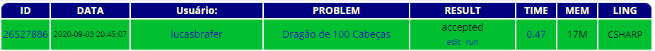

## Grafos - Desafio do dragão :dragon:
Código desenvolvido para resolução do desafio https://br.spoj.com/problems/DRAGAOMG/

### Problema - Dragão de 100 Cabeças :clipboard:
Em seu caminho para salvar uma princesa, um cavaleiro encontra um dragão de 100 cabeças. Com um golpe de espada ele pode cortar 7, 11, ou 15 cabeças. Porém, para cada um desses golpes, novas cabeças nascem imediatamente (respectivamente 10, 16 e 11). Em outras palavras, se ele cortar 7 cabeças, nascem 10 novas. Se ele cortar 11 nascem 16, e se ele cortar 15 nascem 11.
O dragão morre apenas se ficar sem cabeça, ou seja, se for aplicado um golpe que corta todas as cabeças restantes (nesse caso não nascem novas cabeças). Quantos golpes o cavaleiro precisa para matar o dragão e assim salvar a princesa?

### Desenvolvimento da Solução :dart:
Foi possível efetuar toda a modelagem e desenvolvimento do problema, alcançando uma solução com baixo nível de complexidade, que por conta disso possui baixo consumo de recursos computacionais. Sendo assim, a solução trafega por todos os caminhos existentes no grafo, eliminando os que chegam avértices de mesmo valor com maior custo, efetuando uma **Busca em profundidade** do vértice inicial até o de valor zero caso seja possível.
1. [:orange_book: Relátorio em Documento da Solução](documento.pdf)
1. [:blue_book: Apresentação em Slide da Solução](apresentacao.pdf)

### Confirmação da Solução :+1:

### O Código :pushpin:
1. [:computer: Código](codigo.cs)

### Licença
[MIT](LICENSE.md)

